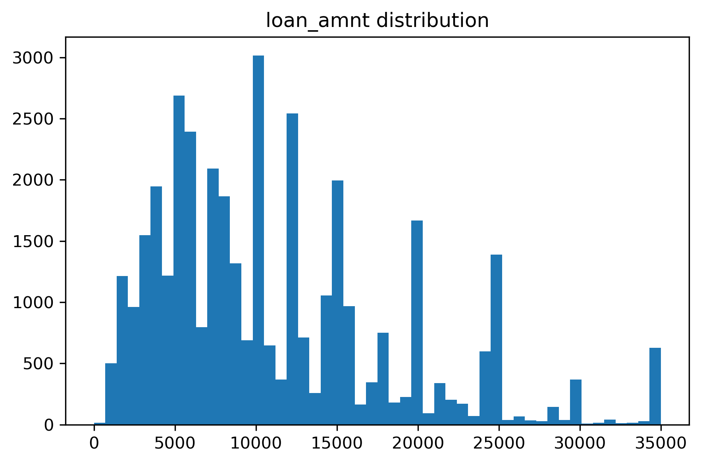
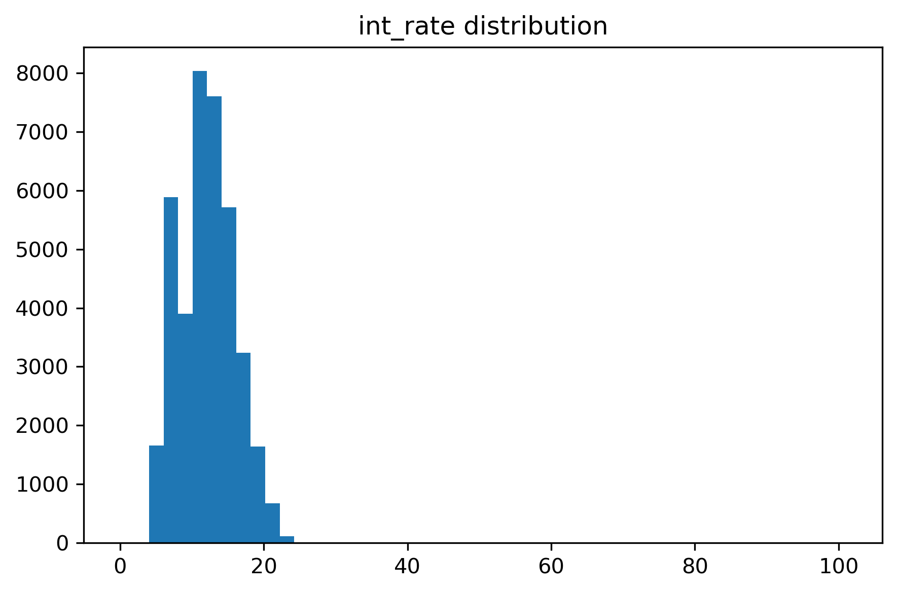
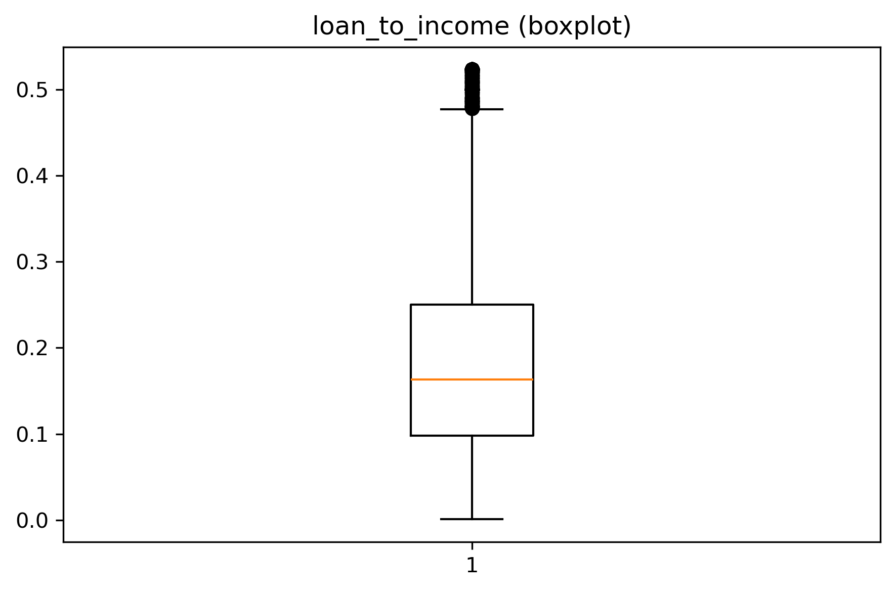
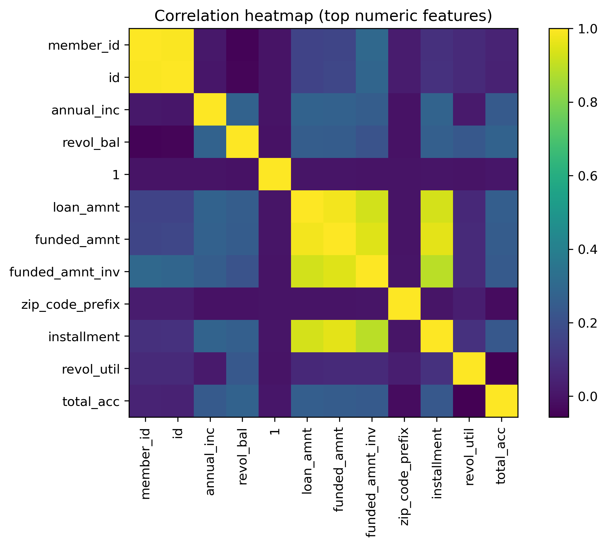
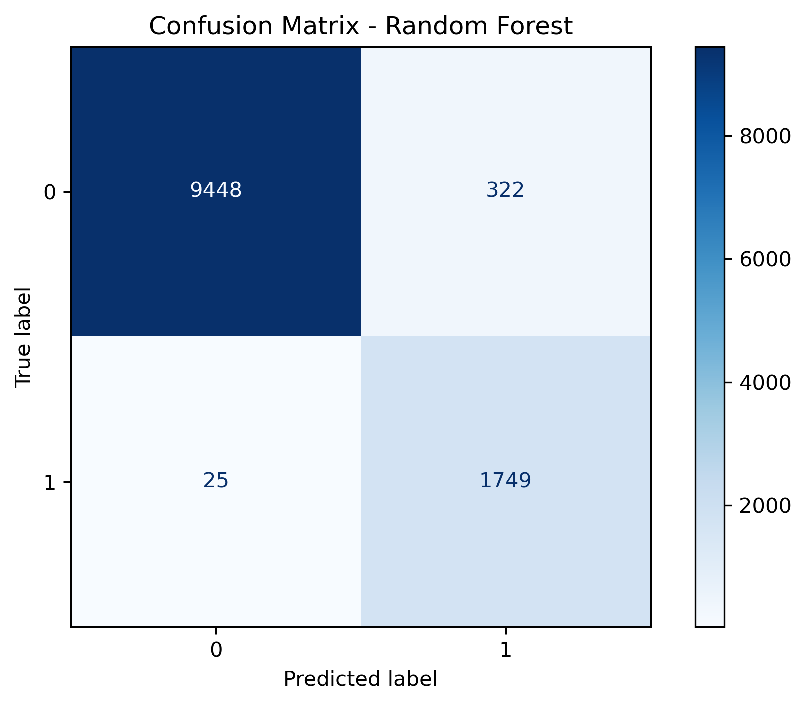
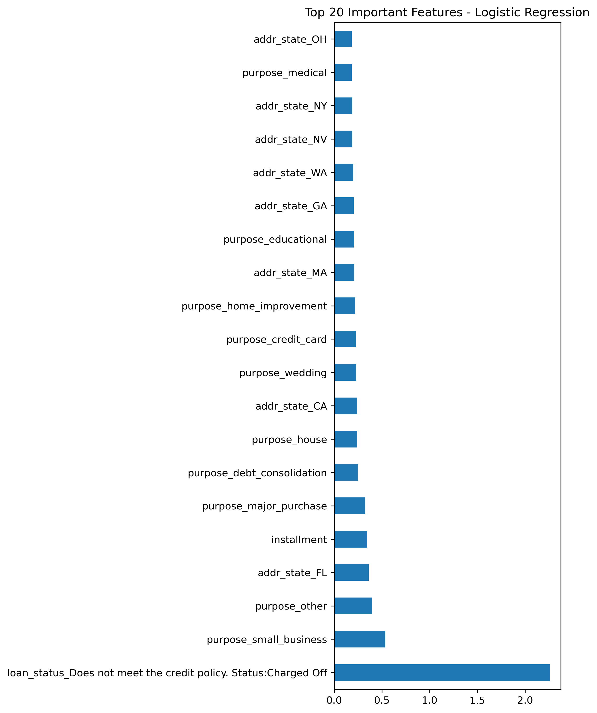
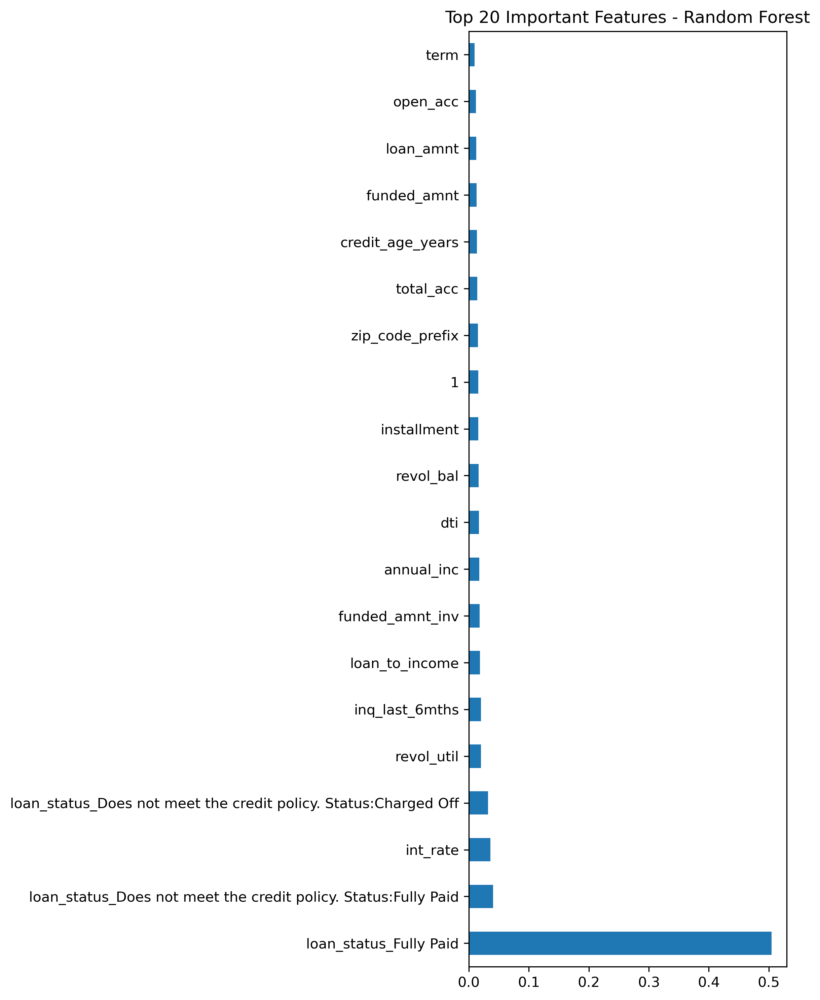
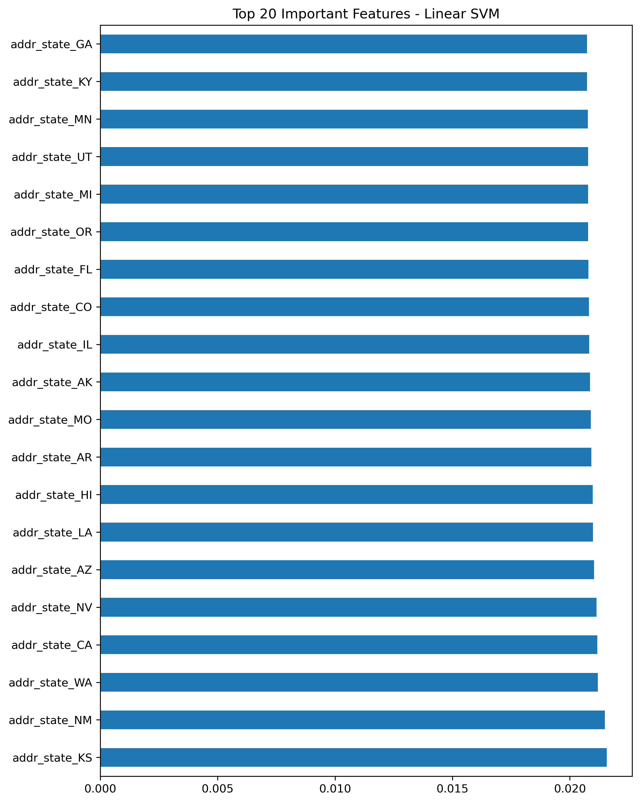

# Loan Default Prediction (Machine Learning Project)

This project uses Machine Learning to predict whether a borrower will default on a loan or fully repay it, based on credit history, income, loan characteristics, and behavioral patterns.

It demonstrates:
- Clean and robust ML pipeline  
- Data cleaning and feature engineering  
- Outlier detection  
- Time-based validation  
- Model comparison  
- Visual explanations (EDA + Feature Importance)

---

# 1. Problem Statement

Lending institutions face financial risk when approving loans.  
This project develops a model that predicts loan default probability, helping institutions:

- Minimize risk  
- Improve approval decisions  
- Understand financial behavior of borrowers  
- Identify high-risk customers early  

---

# 2. Dataset Description
 
Dataset includes:
- Borrower information (income, employment, credit history)  
- Loan details (amount, term, interest rate)  
- Credit behavior (utilization, delinquencies)  
- Loan status (default or repaid)

Target variable:
(images/target_distribution.png)
```
repay_fail = 1 → Default
repay_fail = 0 → Fully Paid
```

---

# 3. Data Cleaning and Preprocessing

### Removed columns with >50% missing

### Removed leakage columns  
(e.g., total_rec_prncp, recoveries, last_pymnt_amnt, etc.)

### Handled missing values  
- Numeric → median  
- Categorical → mode  

### Processed dates  
- Converted issue_d and earliest_cr_line  
- Calculated credit_age_years

### Processed employment length  
Converted strings like "10+ years", "< 1 year" → numeric.

### Outlier Detection  
- Isolation Forest flag  
- IQR outlier count per borrower

---

# 4. Feature Engineering

Created features such as:
- loan_to_income  
- credit_age_years  
- int_rate (cleaned)  
- revol_util (cleaned)  
- zip_code_prefix  
- outlier flags  
- One-hot encoded categories  

---

# 5. Exploratory Data Analysis (EDA)

### Loan Amount Distribution  


### Interest Rate Distribution  


### Loan-to-Income Ratio  


### Log Distribution  


### Correlation Heatmap  


---

# 6. Train-Test Split (Time-Based)

A 70-30 time-based split was used using `issue_d`, ensuring the model only sees past data and predicts future trends.

Scaling and alignment were done after splitting to avoid data leakage.

---

# 7. Machine Learning Models Used

- Logistic Regression  
- Random Forest  
- Linear SVM  

Each model was evaluated on the held-out test set.

---

# 8. Model Performance

| Model               | Accuracy |
|---------------------|----------|
| Logistic Regression | 0.998     |
| Random Forest       | 0.969     |
| Linear SVM          | 1.000     |

---

# 9. Confusion Matrices

### Logistic Regression  


### Random Forest  


### Linear SVM  


---

# 10. Feature Importance

### Logistic Regression  


### Random Forest  


### Linear SVM  


---

# 11. Key Insights

- High loan-to-income ratios strongly correlate with default.  
- Higher revol_util (credit utilization) increases risk.  
- Longer credit age reduces default likelihood.  
- Interest rate, annual income, and outlier flags are significant predictors.

---

# 12. How to Run This Project

Clone the repository:

```bash
git clone https://github.com/yourusername/loan-default-prediction.git
cd loan-default-prediction
```

Install dependencies:

```bash
pip install -r requirements.txt
```

Open Jupyter Notebook:

```bash
jupyter notebook
```

Then open:

```
code.ipynb
```

---

# 13. Repository Structure

```
Loan-Default-Prediction/
│
├── images/                           # All plots, confusion matrices and feature importance
├── Anonymize_Loan_Default_data.csv   # Original raw dataset
├── cleaned_data.csv                  # Cleaned dataset after preprocessing
├── code.ipynb                        # Main notebook
├── README.md                   
└── requirements.txt            
```

---

# 14. Conclusion

Linear SVM performs the best with 100% accuracy on the test set, followed closely by Logistic Regression.  
Loan default is highly predictable using engineered features such as loan-to-income ratio, credit utilization, and credit age.

---

# 15. Future Improvements

- Test XGBoost or LightGBM  
- Add SHAP explainability  
- Build a small web interface  
- Deploy using Streamlit or Flask  

---

# 16. Acknowledgements

This project was completed as part of a Data Science learning journey with focus on building a clean, leak-proof ML pipeline.